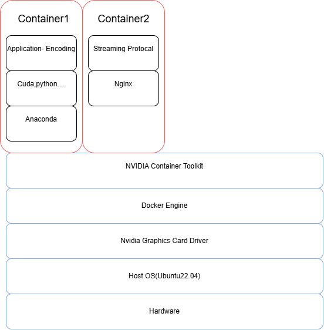
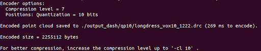
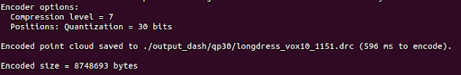
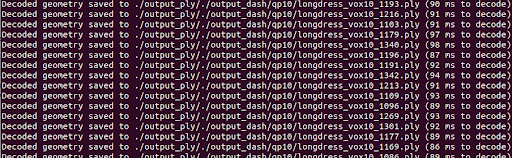
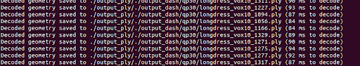
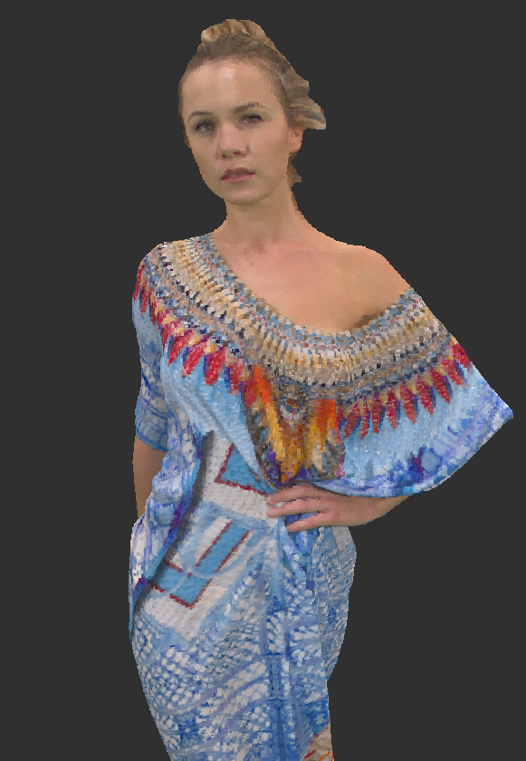
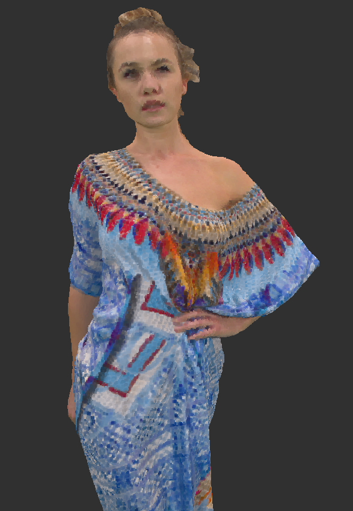
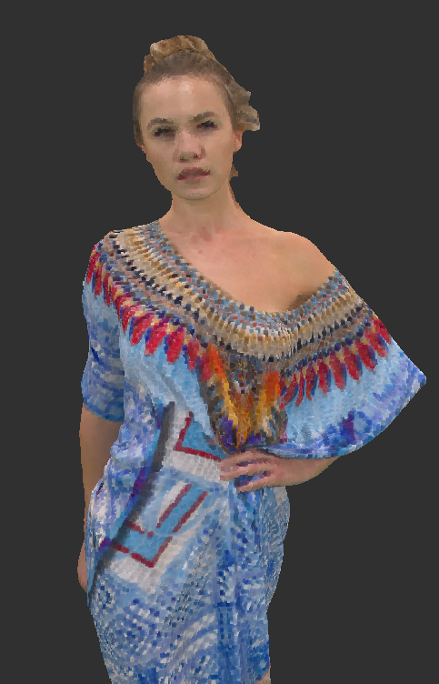

# PointCloudStreaming
This project demonstrates a GPU-accelerated system for encoding and streaming with the following architecture:

## **Prerequisites**
Before setting up the system, ensure the following prerequisites are met:
1. A machine with GPU support (NVIDIA).
2. Ubuntu 22.04 installed on the host machine.

---
# Two Sultions Point Cloud Streaming System：

## **Application 1: Optimal Volumetric Video Streaming With Hybrid Saliency-Based Tiling**

### **Source Code**
- GitHub Repository: [Narwhal-volumetric-video-streaming-system](https://github.com/UniquezCs/Narwhal-volumetric-video-streaming-system)

### **Hardware and Deployment**
- **Server**: DASH server (Nginx-based HTTP web server)
- **Client**: A PC connected to the server

### **Software Stack**
- **Video Codec**: VPCC-TMC2-v7 *(Note: Not found in the GitHub repository)*
- **Streaming Protocol**: DASH protocol for client-server communication
- **Compression**: Draco for compressing volumetric data
- **Volumetric Video Player**: Developed using:
  - Visual Studio 2017
  - PCL 1.9.1 (Point Cloud Library)
  - Qt 5.12 (C++ GUI application development framework)

### **Media**
- **Dataset**: Basketball captured by 8I
  - Original voxelized dataset: [Plenodb 8I Labs](http://plenodb.jpeg.org/pc/8ilabs)

---

## **Application 2: Volumetric Streaming System Using Unity**

### **Source Code**
- GitHub Repository: [Streaming.KOM](https://github.com/yaseenit/Streaming.KOM)

### **Software Stack**
- **Streaming Protocol**: DASH protocol
- **Compression**: Draco
- **Volumetric Video Player**: Unity for client

## **Installation Instructions**

### 1. **Install NVIDIA Graphics Card Driver**
Follow the official instructions to install NVIDIA drivers on Ubuntu:  
[NVIDIA Driver Installation Guide](https://docs.nvidia.com/datacenter/tesla/tesla-installation-notes/index.html)
Current Version：535

---

### 2. **Install Docker Engine**
Refer to Docker's official documentation for installing Docker on Ubuntu:  
[Docker Engine Installation Guide](https://docs.docker.com/engine/install/ubuntu/)

---

### 3. **Install NVIDIA Container Toolkit**
Refer to NVIDIA's official documentation to set up the NVIDIA Container Toolkit for Docker:  
[NVIDIA Container Toolkit Guide](https://docs.nvidia.com/datacenter/cloud-native/container-toolkit/install-guide.html)

---

### 4. **Set Up Containers**
#### Container 1: Encoding Application
- Build a container with the required dependencies:
  - CUDA    11.8
  - Python
  - Anaconda    https://www.anaconda.com/
- Tutorial Follow
  [Dockerfile Reference](https://medium.com/@ochwada/efficient-python-development-combining-the-powers-of-docker-conda-and-vs-code-8e5c0b9c75b0)

#### Container 2: Streaming Protocol with Nginx
- Build a container for streaming with Nginx.
- Refer to the Nginx Docker documentation for configuration:  
  [Nginx Docker Guide](https://hub.docker.com/_/nginx)

---

## **Testing and Validation**
1.Compression result:
## Input Statistics

| Input File Name          | File Size      |
|--------------------------|----------------|
| `longdress_vox10_1067.ply` | 18.0 MB (17,998,530 bytes) |

## Combined Encoding and Decoding Statistics

| QP Value | Encoded File Name         | Encoded Size (Bytes)  | Encoding Time (ms)  | Mean Decoded File Size (Bytes) | Mean Decoding Time (ms)|
|----------|---------------------------|-----------------------|---------------------|-------------------------------|-------------------------|
| 10       | `longdress_vox10.drc`     | around 2,255,112      | around 269          | ~12,000,000                   | 90.75                   |
| 30       | `longdress_vox30.drc`     | around 8,748,693      | around 596          | ~12,000,000                   | 86.25                   |

### QP = 10 (low Quality)
Visualization of the encoded point cloud with QP = 10:

---

### QP = 30 (high Quality)
Visualization of the encoded point cloud with QP = 30:

---
### QP = 10 (low Quality)
Visualization of the decoded point cloud with QP = 10:

---

### QP = 30 (high Quality)
Visualization of the decoded point cloud with QP = 30:

## Visualization Comparison

The following visualization compares the input point cloud with the decoded outputs for QP = 10 and QP = 30.

  

    
    
Input Point Cloud

  

  

    
    
Decoded QP 10

  

  

    
    
Decoded QP 30

  

2. Access the Nginx server through your browser at `http://localhost:8080`.

---

## **License**
This project is licensed under the MIT License. See the `LICENSE` file for details.
